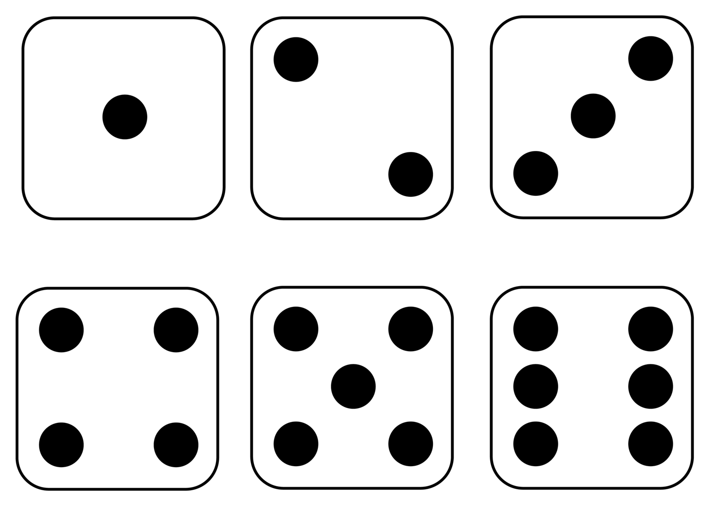

# jogos_em_javascript
 

    
 Sejá benvindo em mas um projeto Desenvolvido por mim esse projeto é um jogo simples mas que vale a pena fazer para se aprimorar nessa linguagem que estou cada vez mas apaixonado 

    
 Esse projeto é um jogo onde você joga e o dado cai em uma numeração projeto criado pensando em minha namorada onde gostamos de decidir quem vai lavar a louça e basicamente você tambem pode brincar. Basicamente você escolhe entre impar ou par e o número que cair se for par alguém ganhou e se cair impar outra pessoa ganhou pode usar com outros tipos de brincadeiras

    
 Esses são as faces do dado que pode cair.. Tenha um bom jogo

    

# Posso copiar

 como em todo projeto que digo copiar e colar não recomendo você mesmo recriar e se tiver dificuldade em alguma coisa olhe esse projeto a final se você não treinar você não será bom. E apenas um copiador Venha se diverti codando começe agora e lembre-se sempre de divirta 
